# Shigen Senso

Shigen Senso is a strategic game where players manage resources, build structures, and engage in battles on a hexagonal grid map. This repository contains the client-side code of the game developed using Unity. 

## Overview

The Shigen Senso Client is responsible for rendering the game world, handling user interactions, and communicating with the backend server for game state updates. The game features a dynamically generated hexagonal map where each tile can represent different types of terrain and player-owned structures.

## Key Features

### Hexagonal Grid Map

- **Dynamic Generation**: The map is generated dynamically using a probabilistic approach to determine the type of each hexagon tile. This ensures that each game session presents a unique map layout.
- **Visualization**: The map is instantiated visually in Unity, with hexagon tiles being created and displayed in real-time. This allows players to see the map being built tile by tile.

### Tile Types

- **Terrain Types**: The map consists of various terrain types such as land, mountains, forests, and crops. These terrains can be free or owned by players.
- **Player Structures**: Players can own different types of structures including castles, stone mines, sawmills, farms, and army camps. Each structure serves a strategic purpose in the game.
- **Combat States**: Certain tiles can be under attack, indicated visually to the players.

### Pathfinding and Accessibility

- **Pathfinding**: The game uses an A* pathfinding algorithm to determine the shortest path between tiles, ensuring that units can navigate the map effectively.
- **Accessibility Check**: After the map is generated, the client ensures that all important tiles are accessible. If any inaccessible areas are found, the map is adjusted accordingly.

### User Interface

- **Interactive UI**: The client provides an interactive user interface for players to manage their resources, build structures, and command units.
- **Real-Time Updates**: The UI updates in real-time to reflect changes in the game state, such as resource production, structure statuses, and battle outcomes.

## Technology Stack

### Unity

The game client is developed using Unity, a powerful game development platform that provides a robust environment for creating 2D and 3D games. Unity’s rich set of features, including physics, rendering, and scripting, make it an ideal choice for developing complex game mechanics and stunning visuals.

### C#

The core logic of the game client is implemented in C#. This includes the hexagonal grid generation, pathfinding algorithms, and game state management. C# is a versatile and efficient programming language that integrates seamlessly with Unity.

### Object-Oriented Design

The game client is designed using object-oriented principles. Key game elements such as tiles, structures, and units are represented as classes, promoting modularity and code reuse. This design approach also makes it easier to extend the game with new features and content.

## Game Demo
- https://youtu.be/0ALPqSQx0po

## Images 

## Hexagon Types
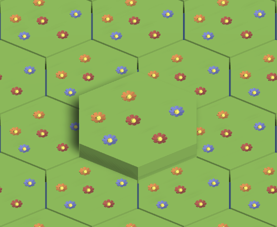
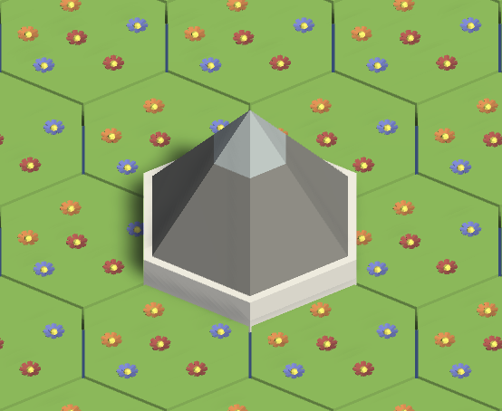
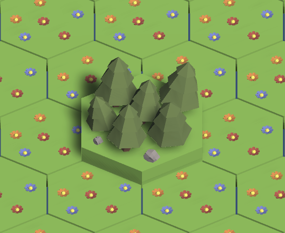
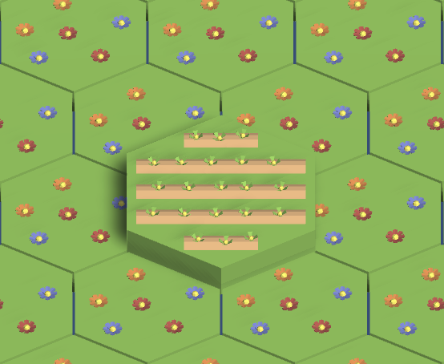

## Map
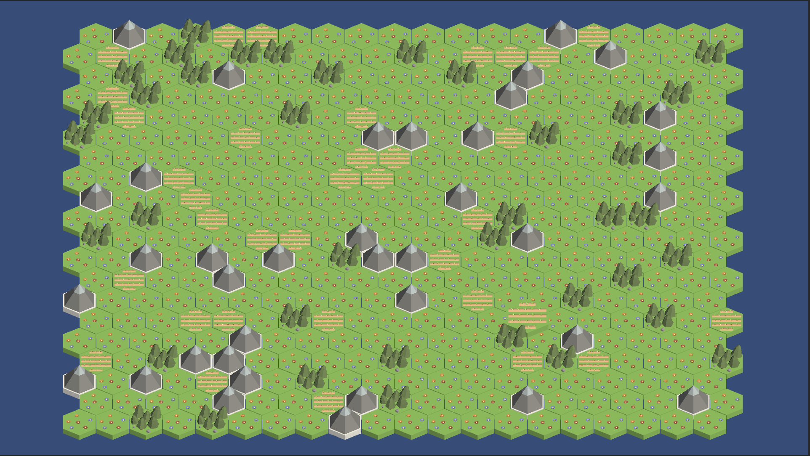

## Structures
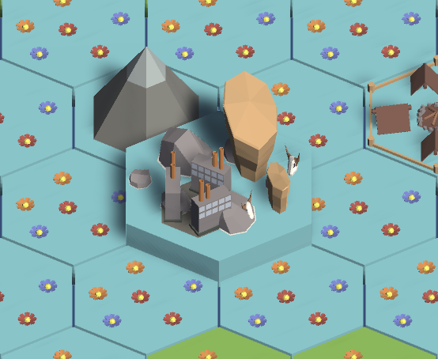
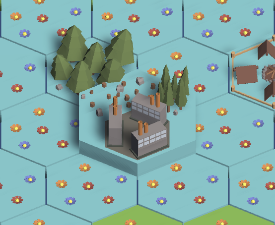
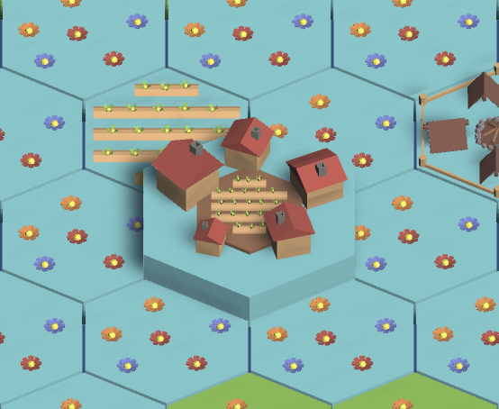

## Resource Collection
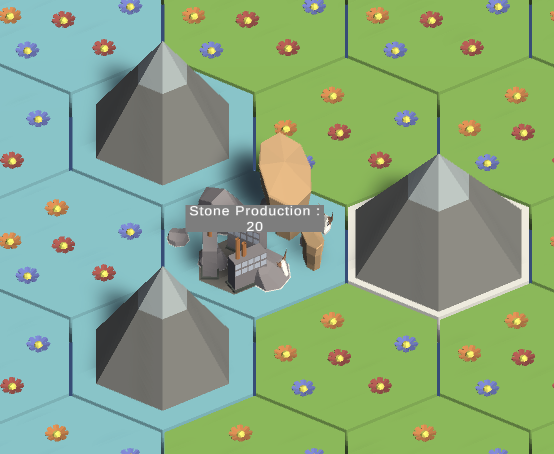
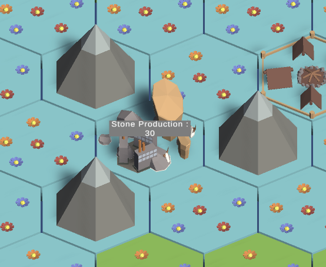

## UI
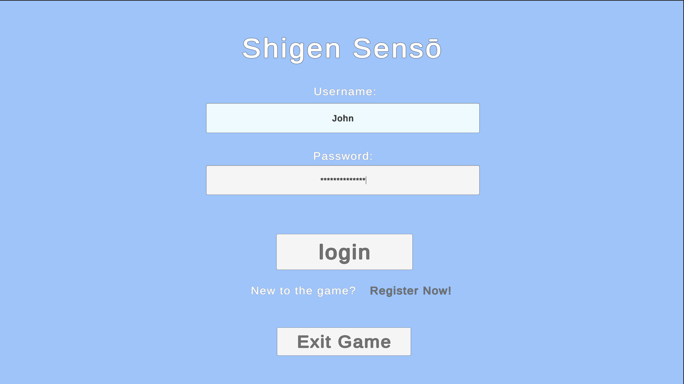
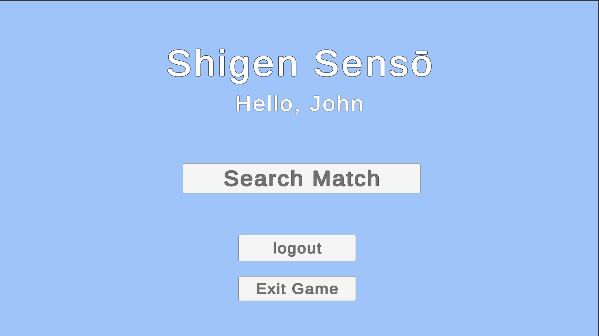
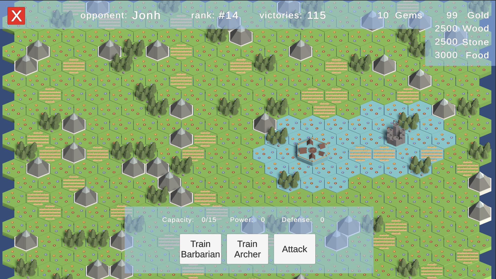
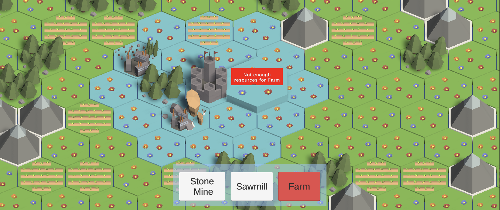
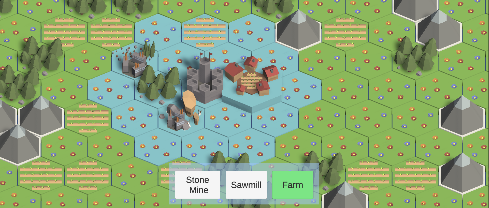

## Pathfinding
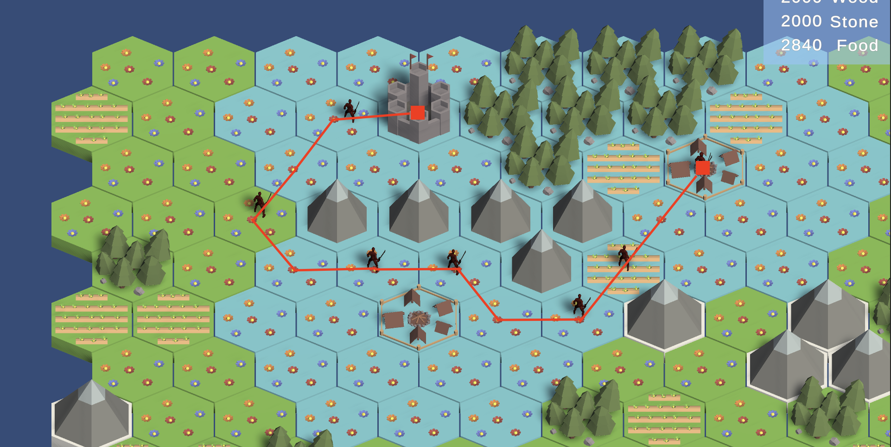
